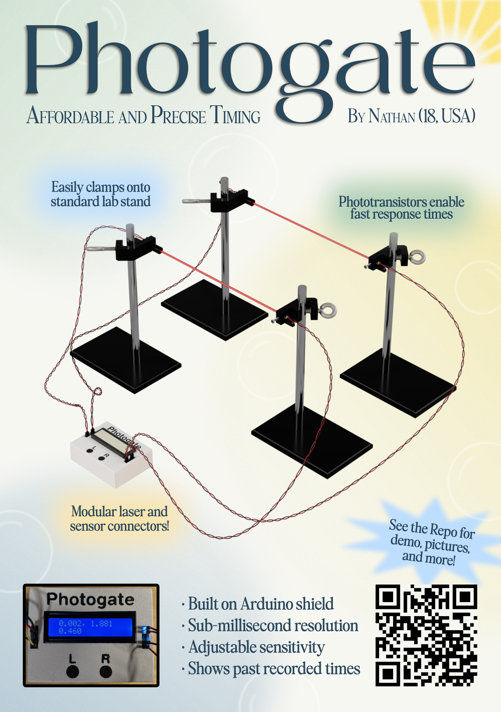
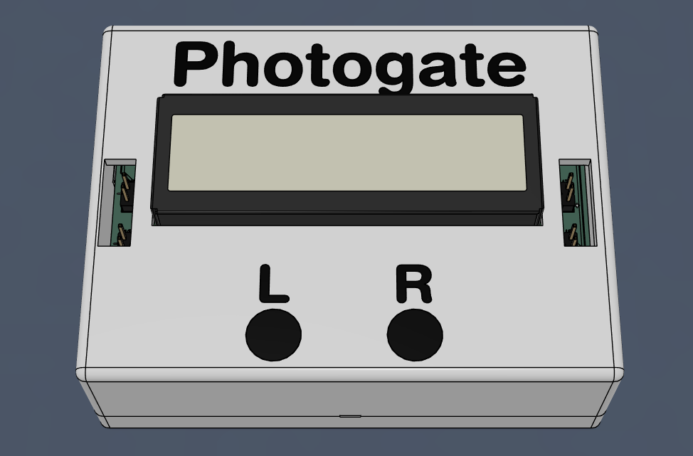
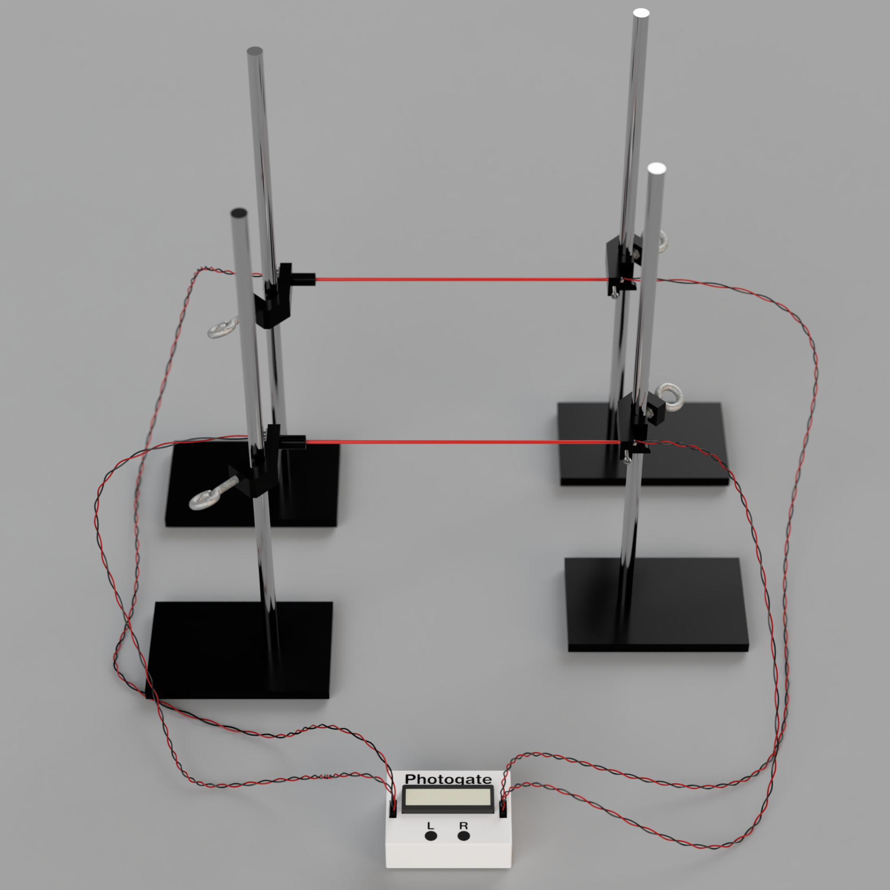
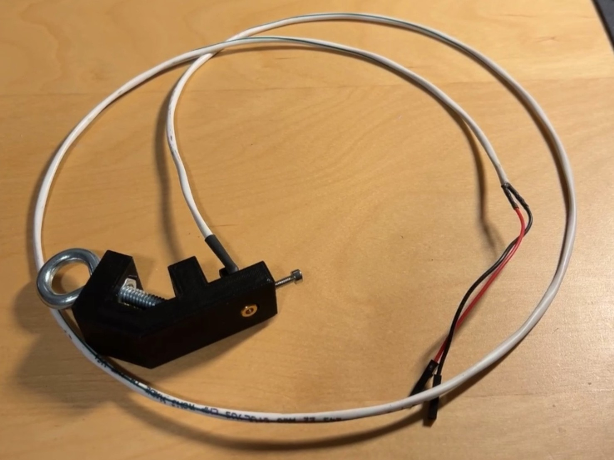
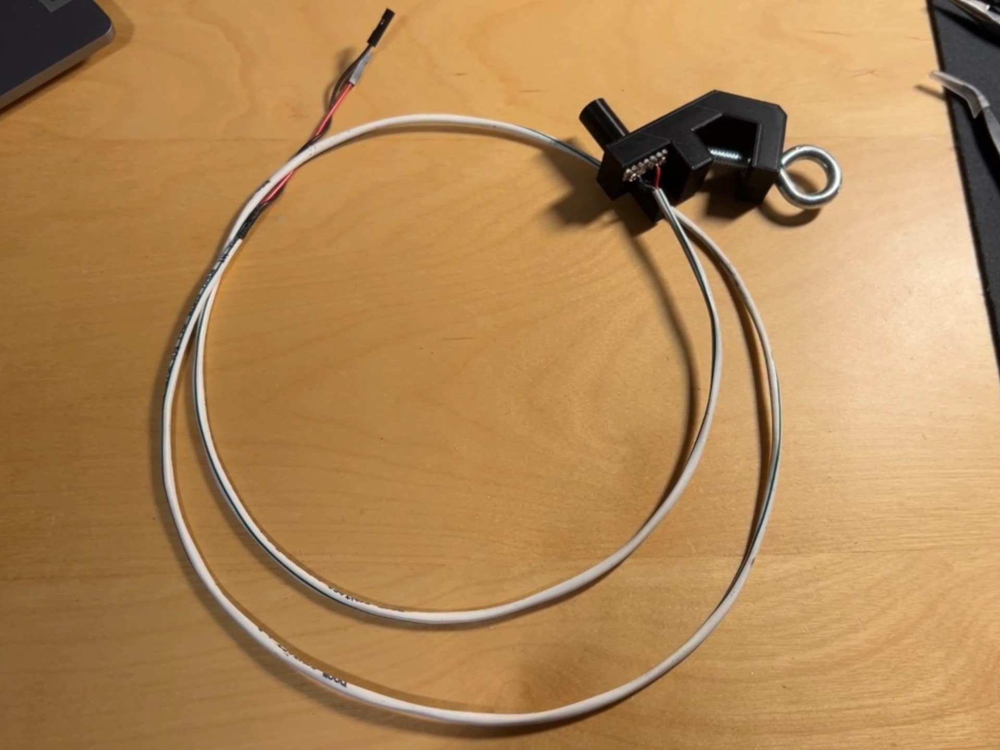
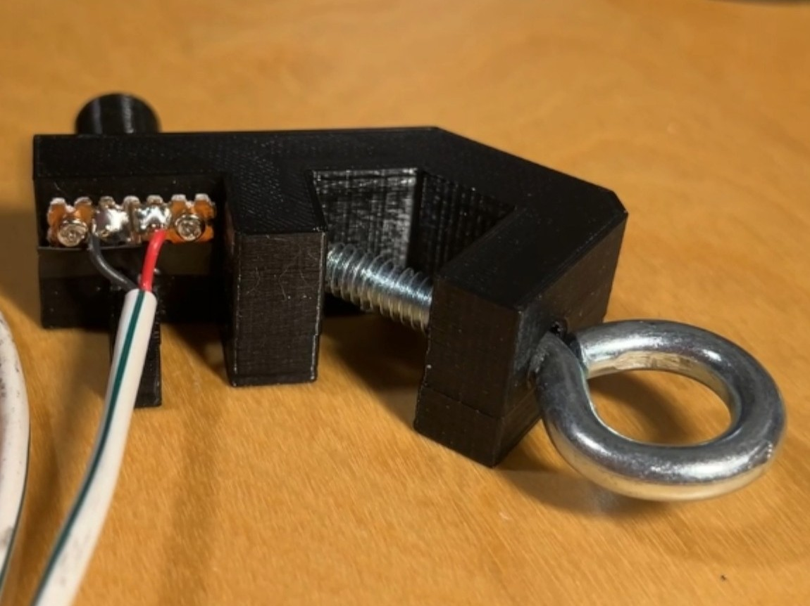
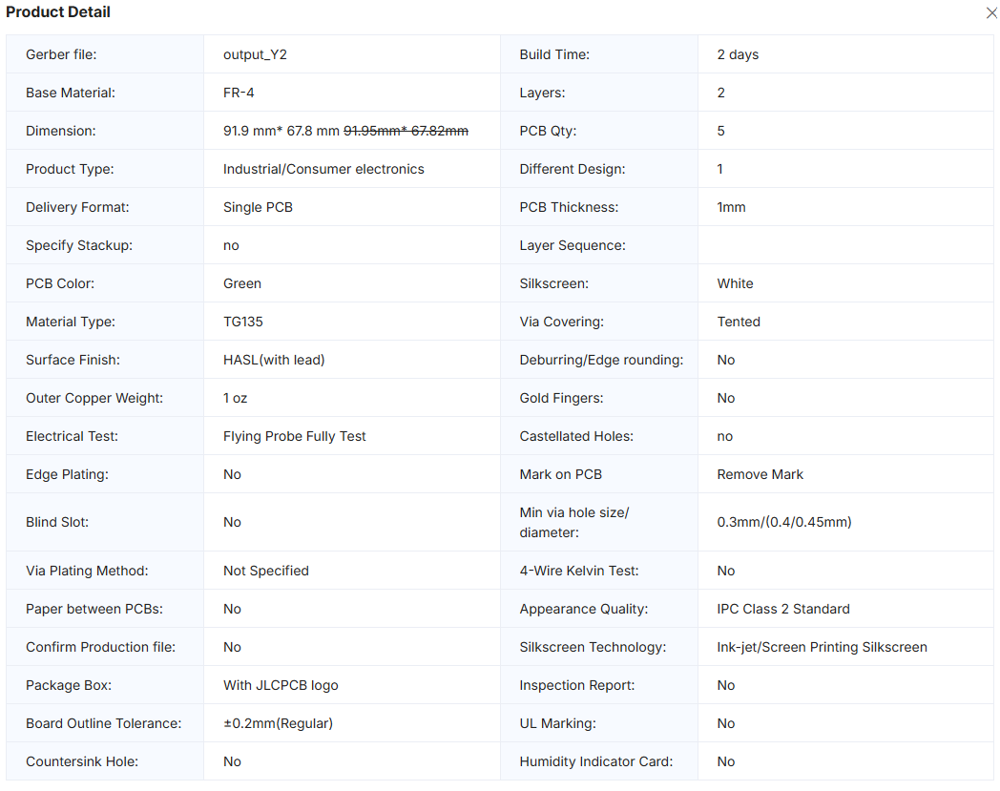
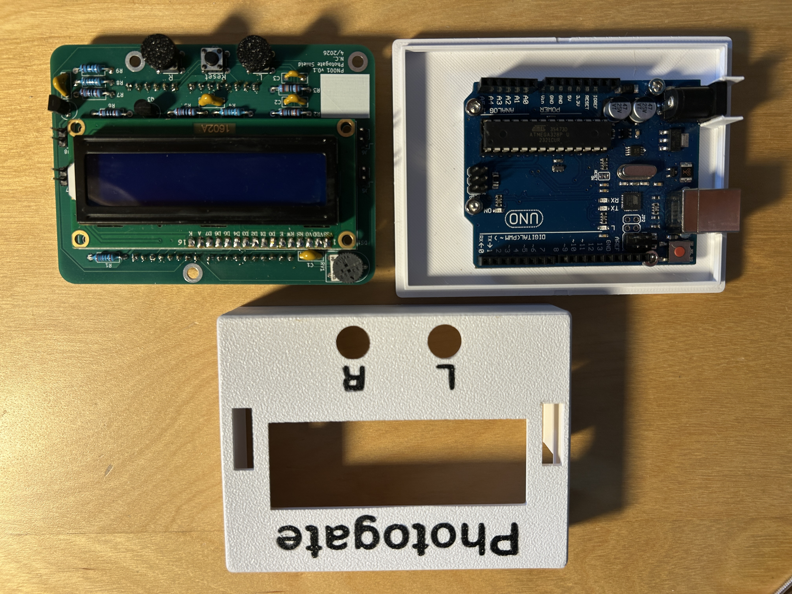
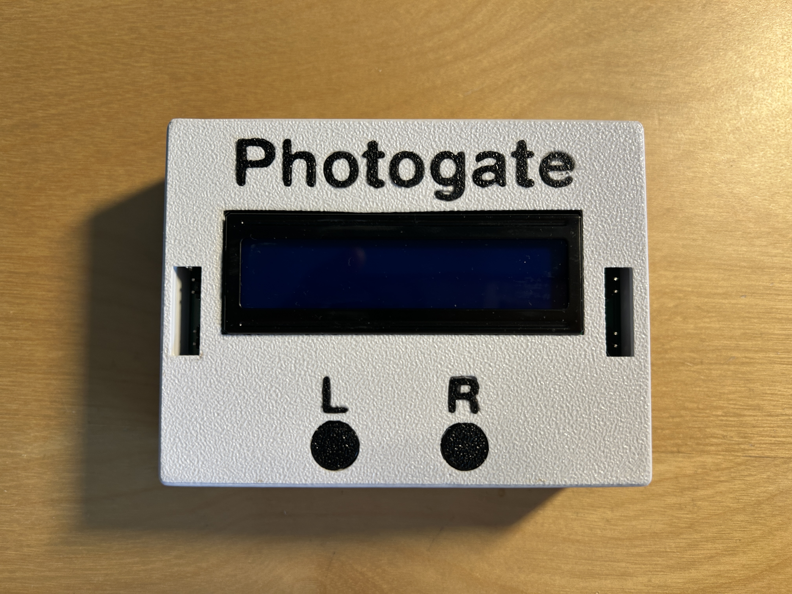

# Photogate

## Description

Photogates allow precise, automatic timing of objects moving between two points. The photogates trigger automatically when a laser beam is interrupted, providing much faster response times than a human ever could with a stopwatch.

This specific project was inspired by my Science Olympiad team's lack of a photogate for the timing events. Commonly available solutions online cost at least $50, with high resolution ones costing hundreds of dollars. This design seeks to lower the barrier to precise timing by using commonly available parts and 3D printed materials for a cost-effective design. The design is fully open source to allow others to replicate and improve on it.

## Features

- Based on the Arduino UNO R3
- Swappable lasers and phototransistors
- Lasers and phototransistors mount to standard lab stands
- Displays last 3 recorded times
- Adjustable sensitivity
- Fully THT design
- Easy assembly

## Basic Usage

1. Position the two lasers perpendicular to the direction of travel at your specified distance.

2. Position the two phototransistors directly across from the two lasers. Each laser should hit straight onto a phototransistor.

3. Plug the lasers into the right side of the main module, and the phototransistors into the left side. The polarities are indicated on the silkscreen: a `+` for the lasers, and a `-` for the phototransistors.

4. Before powering up the module, cover both lasers so that calibration can occur. Alternatively, plug the module in first, cover the lasers, and then press `R` to calibrate.

5. After calibration, make sure that the phototransistors are functioning by each beam independently. One of the interruptions should start the timing, indicated by `Timing...` on the LCD. The other interruption should stop the timing.
   - This is a good time to check the order of the phototransistors. If the order is incorrect, then simply plug the phototransistor in the top slot into the bottom slot and vice versa.

6. If everything has been executed correctly, then your photogate should be ready for timing! If you need to recalibrate at any point, simply interrput both beams and press `R` again.

## Assembly

### 3D Printing

All 3D printing related files are included in the [`3D_Printing`](3D_Printing) directory. This includes the original `.f3d`, `.step`, and `.3mf` files.

If you don't use the `.3mf` file to slice, below are the parameters that I used.

|Parameter|Value|
|---------|-----|
|Material|PLA|
|Layer Height|0.2mm|
|Nozzle|0.4mm|
|Infill|<20%|

The biggest issue I had was with printing the lettering due to some elephant's foot, but if you have a multicolor printer then this won't be an issue. Otherwise, you may need to play around with the letter offsets and/or printer settings to get the letters to fit. The lettering is also entirely visual, so you can skip it if you want.

### Lasers

1. Cut and strip the 2 strand wire to the necessary length.

2. Cut heat shrink to the necessary length. I used heat shrink with a diameter that allows it to grab onto the laser diode's PCB when flattened so some strain relief is provided to the wire.

3. Solder female headers to one end of the wire.

4. Remove the presoldered wire from the laser diode, taking note of which side of the resistor the negative wire was attached to.

5. Slip the heat shrink onto the 2 strand wire.

6. Solder the 2 strand wire to the laser diode. The negative wire should bypass the included resistor by soldering to the side that the original wire wasn't connected to. Otherwise, the current source circuit may not be able to drive the laser.
    - A multimeter in the diode mode can check which side of the resistor to solder to. The side of the resistor with a lower voltage reading bypasses the resistor.

7. Test the connection by plugging the headers onto the laser pins on the shield and powering it on.

8. If laser powers on, then use the heat shrink over the flat portion of the laser's PCB. Don't slide it over the metal cylindrical section, otherwise the laser won't fit into the 3D printed mount.

9. Slide the laser diode into the 3D print, and use a M3x10 set screw to hold it in place.

10. Place the nut into the 3D print, and screw the eye bolt in. You can optionally glue the nut in place, but I chose not to just so I can remove it later if necessary.

The finshed result should look something like this:

### Phototransistors

1. Score and cut a 1x6 section of copper plated perfboard. If your perfboard has one continous copper side, then remove a small line of copper the middle of the board, leaving connections from holes 1-3 and holes 4-6.

2. Drill the first and last holes in the perfboard with a 7/64" drill bit to allow a M2 screw through.

3. Cut and strip the 2 strand wire to the necessary length.

4. Solder female headers to one end of the wire.

5. Bend the phototransistor leads towards the flat side of the package approximately 2.5mm from the bottom of the package. The phototransistor should be able to sit inside of the recession in the 3D print and the leads should stick through the 3rd and 4th holes of the perfboard.

6. With the phototransistor inside the recession, screw the perfboard to the 3D print using 2 M2x4 screws with the copper side facing out.

7. Solder the phototransistor to the perfboard, careful not to let the two sides short out.

8. Solder the 2 strand wire to the two remaining holes in the perfboard. With the phototransistor pointing down, the collector/positive is the right hole, and the emitter/negative is the left hole.

9. Test the connection by measuring the "resistance" of the phototransistor. With the positive lead connected to the collecter and negative lead connected to the emitter, the resistance should start high and go lower when exposed to light. When the leads are switched, the resistance is always high or open.

10. Place the nut into the 3D print, and screw the eye bolt in. You can optionally glue the nut in place, but I chose not to just so I can remove it later if necessary.

11. With a small strip of black electrical tape, cover the back side of the phototransistor to stop ambient light from hitting the sensor.

12. Glue the 3D printed cylinder to the mount, making sure that it sits perpendicular to the front face of the mount and doesn't interfere with the path of light.

The finshed result should look something like this:

### Shield

1. Order a PCB from your desired PCB manufacturer (I used JLCPCB) with the included [Gerbers](PCB/Gerber.zip). Refer to the following image for the ordering info: 

2. Using the included [KiCad project](PCB/KiCad.zip), solder the components to their respective places on the PCB. Everything is throughhole and can be soldered by hand, but be especially careful while soldering the transistors since the pitch is quite small. The schematics and PCB can also be viewed in [`photos/Circuit`](photos/Circuit).

### Final Assembly

1. Screw the Arduino UNO R3 onto the bottom plate with 4x M3x6 screws.

2. Firmly push the shield onto the top of the UNO, making sure that all header pins line up.

3. Place the top cover over the shield, and firmly push down until the cover snaps into place.

4. Glue the lettering and buttons into place.
   - Make sure not to test the fit for the buttons (with the cover on as well) before gluing. When gluing, make sure not to put too much that it clogs up the button.

5. Upload the code by cloning this repository and opening PlatformIO file.

6. Test that everything works by going to [Basic Usage](#basic-usage)

## BOM

The BOM can be viewed in [`BOM.csv`](BOM.csv)

## Todo

- distance input for avg speed
- switch phototransistor 0 and 1 (automatically?)
- single laser mode
- Output data to serial
- New board: control laser on/off with arduino
